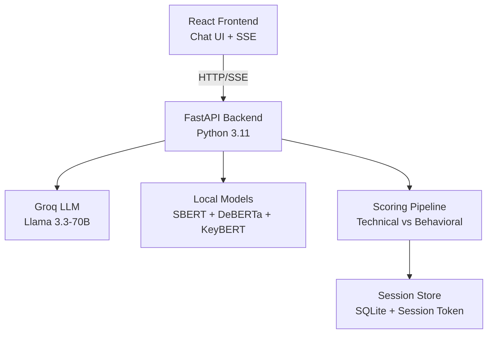

# PrepBuddy — Interview Evaluation System

[](#)
[](https://fastapi.tiangolo.com/)
[](https://react.dev/)
[](#)
[](LICENSE)

**PrepBuddy** is a full-stack interview preparation platform combining local NLP models with cloud LLMs (Groq Llama 3.3-70B) to generate role-specific questions and evaluate answers using multi-signal hybrid scoring pipelines. Produces rubric-backed feedback, per-question grades, and session summaries.

---

## 🚀 Features

| Feature | Description |
|---------|-------------|
| **Role-aware Q&A** | Generate questions by role, experience level, category, difficulty |
| **Real-time scoring** | SSE streaming evaluation with 4-signal hybrid pipeline |
| **Dual pipelines** | Technical (claim-based) + Behavioral (STAR rubric) |
| **Rich feedback** | Per-question scores, missing keywords, claim coverage, LLM feedback |
| **Session analytics** | Overall grade, strongest/weakest areas, rubric averages |
| **Session recovery** | SQLite-backed sessions with interrupted-evaluation restore support |
| **Session access control** | Per-session bearer token required for status, answer, and summary reads |

---

## 🏗️ Architecture



**Scoring Pipeline Decision Tree:**
```
is_behavioral(category)? 
├── YES → STAR Behavioral Pipeline (60% LLM)
└── NO  → Claim-Based Technical Pipeline (50% Claims)
```

---

## 📁 Project Structure

```
PrepBuddy/
├── backend/                    # FastAPI + NLP scoring
│   ├── app/
│   │   ├── main.py            # FastAPI app entrypoint
│   │   ├── routers/           # API endpoints
│   │   ├── services/          # Business logic
│   │   └── scoring/           # Multi-signal pipelines
│   ├── data/                  # SQLite session store
│   ├── evaluation/            # Research + grid search
│   └── tests/                 # pytest suite
├── frontend/                  # React 18 chat UI
│   ├── src/
│   │   ├── hooks/useChat.js   # Session state machine
│   │   ├── components/        # ChatWindow, ScoreCard, etc.
│   │   └── utils/api.js       # SSE + API wrapper
└── README.md
```

---

## 🛠️ Tech Stack

| Category | Technologies |
|----------|--------------|
| **Backend** | FastAPI, Pydantic v2, PyTorch, Sentence Transformers, spaCy, Groq SDK |
| **Frontend** | React 18, Custom Hooks, SSE-style streaming via `fetch`, browser speech recognition |
| **Scoring** | SBERT (`all-MiniLM-L6-v2`), DeBERTa NLI, KeyBERT, Llama 3.3-70B/3.1-8B |
| **Infra** | uvicorn ASGI, SQLite (WAL mode), Thread-safe ModelRegistry, Auto device detection (MPS/CUDA/CPU) |

---

## ⚙️ Quick Setup

1. **Clone & Install Backend**
```bash
cd backend
python -m venv venv
source venv/bin/activate      # Linux/macOS
pip install -r requirements.txt
python -m spacy download en_core_web_sm
cp .env.example .env          # Add GROQ_API_KEY
```

2. **Install Frontend**
```bash
cd frontend
npm install
```

3. **Run Both**
```bash
# Backend (with hot reload)
uvicorn app.main:app --host 0.0.0.0 --port 8000 --reload

# Frontend
npm start                    # http://localhost:3000
```

**API Docs**: http://localhost:8000/docs

---

## 📊 Scoring Pipelines

**Technical Pipeline** (composite_v2) - 0-100 scale
| Signal | Weight | Measures |
|--------|--------|----------|
| SBERT | 25% | Semantic similarity |
| NLI | 10% | Entailment/contradiction |
| Keywords | 5% | KeyBERT term coverage |
| **Claims** | **50%** | Ideal answer claim coverage |
| LLM Judge | 10% | Correctness, completeness, clarity, depth |

**Behavioral Pipeline** (STAR)
| Signal | Weight | Measures |
|--------|--------|----------|
| SBERT | 25% | Semantic alignment |
| NLI | 5% | Logical consistency |
| Keywords | 10% | Domain terms |
| **STAR LLM** | **60%** | Situation/Task/Action/Result/Reflection |

---

## 🔬 Evaluation Results

**Current Research Snapshot**:
```
Best offline claim-hybrid NLP method on the labeled dataset:
Pearson r = 0.9165
Spearman r = 0.8675
```

Technical anchor calibration is derived from `evaluation/report.json`.
Behavioral anchor calibration is derived from `evaluation/behavioral_calibration.json`.

**Metrics Used**:
- BERTScore (DeBERTa-XL-MNLI)
- ROUGE-1/L
- Pearson/Spearman correlation

---

## 📖 API Reference

| Endpoint | Method | Description |
|----------|--------|-------------|
| `/api/generate_questions` | POST | Create session with N diverse questions |
| `/api/evaluate_answer_sse` | POST | **Streaming** answer evaluation |
| `/api/evaluate_answer` | POST | Blocking answer evaluation |
| `/api/session_status` | GET | Session state, answer count, in-progress indices |
| `/api/answer_result` | GET | Fetch stored scorecard for one answered question |
| `/api/session_summary` | GET | Session summary + analytics |

`/api/generate_questions` returns both `session_id` and `session_token`. Every later session-scoped endpoint requires the token in the `X-Session-Token` header.

**Example Request**:
```json
{
  "role": "Software Engineer",
  "level": "Junior", 
  "category": "Data Structures",
  "difficulty": "Medium",
  "num_questions": 5
}
```

---

## 🧪 Testing

```bash
cd backend
pytest tests/ -v              # Backend API + scoring
cd ../frontend
npm test                      # Frontend components
```

**Coverage**: Schema validation, claim pipeline, calibration, SSE streaming, recovery, auth, session management.

---

## ⚖️ Grading Scale

| Score | Grade |
|-------|-------|
| 80-100 | Excellent |
| 60-79 | Good |
| 40-59 | Needs Improvement |
| 0-39 | Significant Gaps |

---

## 🔧 Configuration

**Required**: `GROQ_API_KEY` in `backend/.env`

**Optional Tuning**:
```
CLAIM_EXTRACTION_MODE=regex        # or 'llm'
SBERT_WEIGHT=0.40
CLAIM_MATCH_THRESHOLD=0.62
DEVICE=mps                         # cpu/cuda/mps (auto-detect)
```

**Storage**:
- Sessions persist in `backend/data/sessions.db`
- SQLite uses WAL mode for cross-worker visibility
- In-progress evaluation locks expire automatically to avoid stuck sessions

---

## 📈 Future Work

- [ ] Multi-user accounts on top of the current session-token model
- [ ] Persistent multi-user storage (PostgreSQL/Redis) beyond the local SQLite store
- [ ] Multi-language support
- [ ] Custom rubrics per company/role
- [ ] Voice input + transcription
- [ ] Leaderboards + sharing

---

## 📄 License

MIT License - see [LICENSE](LICENSE) © 2026 Chaitanya Pudota
